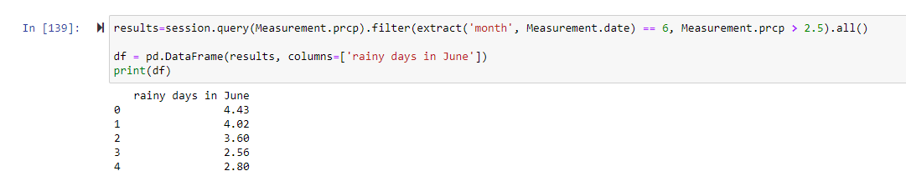

# SQLite, SQLAlchemy - surfs_up company analysis 
## Purpose: 
Running some analytics on a weather data for a surf &amp; shake Shoppe serving surfboards and ice cream to locals tourist in Hawaii.
### Overview of the analysis: surfs_up
In order to determine if the surf and ice cream shop business is sustainable year-round the client would like to see temperature data for the montsh of June and December in Oahu. We've given 'measurements' and 'stations' tables in 'hawaii.sqlite' database. We need to filter out the data and present the min, max, ave temperatures and all statistics for June and December using Python, Pandas functions and methods, and SQLAlchemy.
## Tools: 
SQLite, SQLAlchemy, Flask, Jupyter Notebook, VS Code, and GitHub

## Results:
When we look at the overview of the analysis we can see that the weather statistics are similar in June and December. The differences can be seen in the following images.
### The three key differences in weather between June and December are:
1. Month of June has more items in the dataset as we can see in the count field; 1700 for June and for December 1517. There is more data for June then December.
2. Standard deviation for December is 3.75 and for June is 3.25. This shows us how spread out the numbers in the dataset are. Less spread out in June normally because we have more data for June. This is obvious in the plots as well.
3. Min temperature in December goes down to 56 whereas in June is 64. Max temperatures are very close. There are really hot days in December as well going up to 83.
The plots showing the statistics gives us a better visual understanding of the summary as seen in the below image.

## Summary:
In summary it is a good idea to open a surf and ice cream shop in Oahu because the statistics presents us the ideal data as we analyzed with tables and plots.
### Rain factor:
We also need to look at the rainy days if any in June and in December. It may be warm in December but the rainy days make a difference for the surfers and ice cream shop. According to wikipedia the following is the rain category. Any prcp rate over 7.6 considered heavy rain. 
Light rain — when the precipitation rate is < 2.5 mm (0.098 in) per hour

Moderate rain — when the precipitation rate is between 2.5 mm (0.098 in) – 7.6 mm (0.30 in) or 10 mm (0.39 in) per hour[106][107]

Heavy rain — when the precipitation rate is > 7.6 mm (0.30 in) per hour,[106] or between 10 mm (0.39 in) and 50 mm (2.0 in) per hour[107]

Violent rain — when the precipitation rate is > 50 mm (2.0 in) per hour

The below images and queries show us the  rain days in June and December. As expected there are more rainy days in December than June, 15 days compared to 4 days in June. There are moderate and close to heavy rain in December which can be dangerous for surfers.

